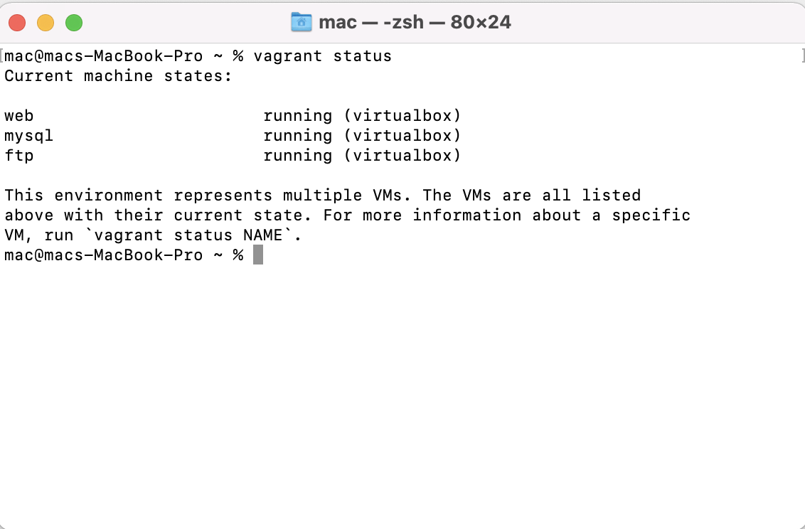
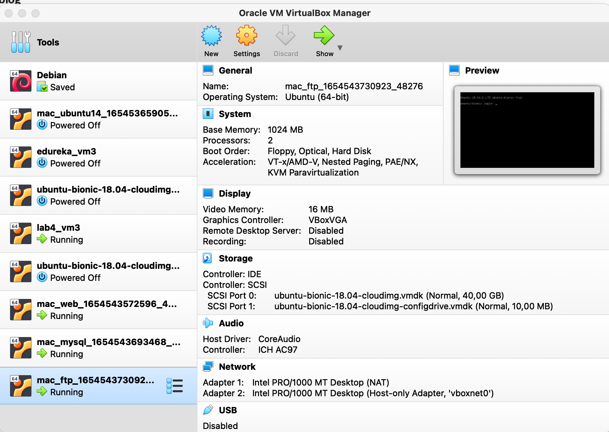

# Terraform best practices

- Clean code: Although terraform is not a programming language, simlar rules of writing code apply to terraform as well.
- Knowing the infrastrcture: YOu need to know exactly what will be created and managed by terraform, particularly when using third-party modules as it becomes crucial to know and understand what resources will be created and what parameters to use.
- Seperating infrastrcuture from configuration: As it reduces complexity.
- Using one state per environment
- Configuring a backend
- Keeping backends small

# Screenshots of VMs

