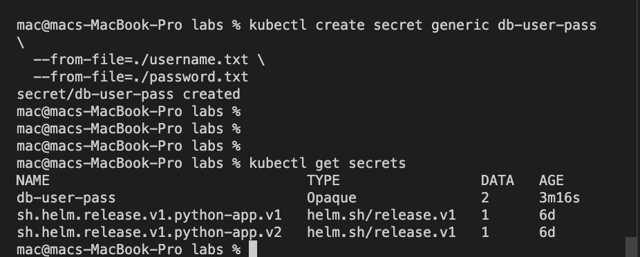
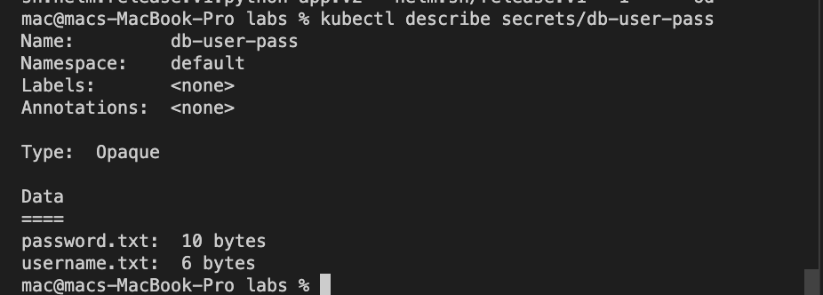
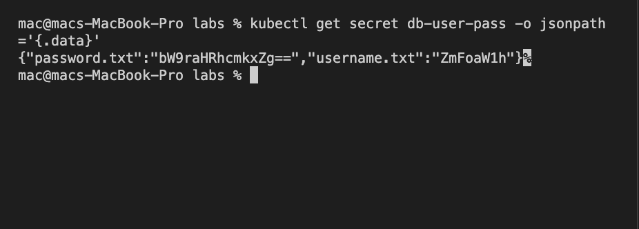
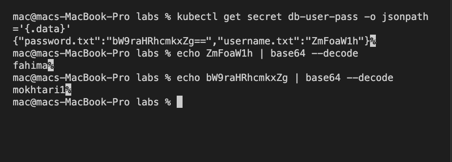
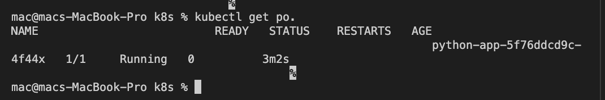
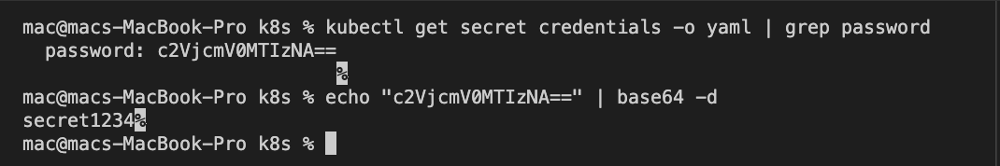

# Verfiying secrets

**Creating/Verifying secrets**

**Describe  secrets** 

**Encode/Decode secrets**

# Helm with secrets

- Output of `% kubectl get po.`

- Output of `kubectl get secret credentials -o yaml | grep password`
