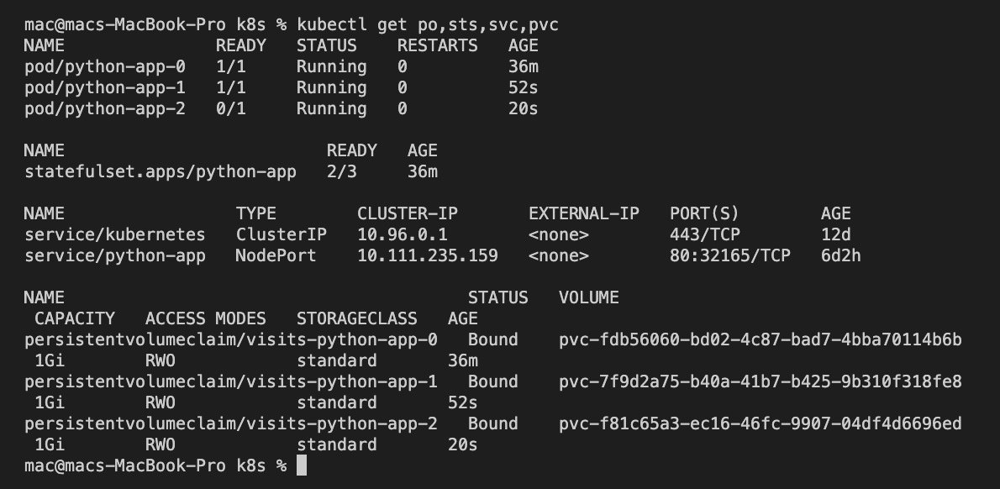

# Output of `kubectl get po,sts,svc,pvc`

# Ouput of `helm install --dry-run --debug python-app python-app`

mac@macs-MacBook-Pro k8s % helm install --dry-run --debug python-app python-app -n default -f ../secrets.yaml
install.go:178: [debug] Original chart version: ""
install.go:195: [debug] CHART PATH: /Users/mac/Documents/labs/k8s/python-app

NAME: python-app
LAST DEPLOYED: Sat Jul  9 19:39:39 2022
NAMESPACE: default
STATUS: pending-install
REVISION: 1
USER-SUPPLIED VALUES:
password: ENC[AES256_GCM,data:9DJxj558pJKkgA==,iv:r92NeeTg7BIRABmteV0WhTztYmzRJh7oThYhtEgbNuU=,tag:zS/QM9+X7wEZvvZsqLCGDQ==,type:str]
sops:
  age: []
  azure_kv: []
  gcp_kms: []
  hc_vault: []
  kms: []
  lastmodified: "2022-07-03T11:36:56Z"
  mac: ENC[AES256_GCM,data:hdiGvCvspq9qIWSe072lL+Pvg/RR9VlcROfaItNyc7PET3IknEwEj5PVLuU8v3GXT/VtSgI9oC5YURedqqfXq38KvHA1fJeYrSlCW+IWs88pfZimQ9bylxrhhBk3FJLrSp/lam0+me1JX1zSDWojqxfePgrrgXjBDdAAYdOEveE=,iv:h8BpCcB5j/ZtVN77d4mqZFA9Q20Tnii+LkSvKKNJkSI=,tag:Kbu6/1R8Oi3VsyWL9+v9qg==,type:str]
  pgp:
  - created_at: "2022-07-03T11:36:33Z"
    enc: |
      -----BEGIN PGP MESSAGE-----

      hF4Dz2k/d7SJE54SAQdAzX8sI2Y/OgKIPYT5JgwQSo+ZJxIx1jebbxvKMvZ8wlkw
      b+9EtULADXwobG/SlVeLhY81CqM9kqUb2nGpyeFvRoSGdxYMTq5fkv20ZO8ay12Z
      1GgBCQIQ24+h3/6vWogizMrb4FXulLpnW8sv0A7S8e0mJo4D1MqPFi6odrAU/xmn
      O7vokVzNpydgbvyLEzvGofbKvfSKHjgETLexnWCa32S75KQCGrKm5TAmaH44VlwT
      ZopTARw0aMuR+w==
      =Xdav
      -----END PGP MESSAGE-----
    fp: 278767785C75E361A5986A30AEC7426228FADE67
  unencrypted_suffix: _unencrypted
  version: 3.7.3

COMPUTED VALUES:
affinity: {}
autoscaling:
  enabled: false
  maxReplicas: 100
  minReplicas: 1
  targetCPUUtilizationPercentage: 80
fullnameOverride: ""
image:
  date: '{{ .Release.Time.Seconds }}'
  pullPolicy: Always
  repository: fahima2019/lab2
  tag: lab2
imagePullSecrets: []
ingress:
  annotations: {}
  className: ""
  enabled: false
  hosts:
  - host: chart-example.local
    paths:
    - path: /
      pathType: ImplementationSpecific
  tls: []
nameOverride: ""
nodeSelector: {}
password: ENC[AES256_GCM,data:9DJxj558pJKkgA==,iv:r92NeeTg7BIRABmteV0WhTztYmzRJh7oThYhtEgbNuU=,tag:zS/QM9+X7wEZvvZsqLCGDQ==,type:str]
podAnnotations: {}
podSecurityContext: {}
replicaCount: 3
resources:
  limits:
    cpu: 110m
    memory: 128Mi
  requests:
    cpu: 100m
    memory: 128Mi
securityContext: {}
service:
  port: 80
  type: NodePort
serviceAccount:
  annotations: {}
  create: true
  name: ""
sops:
  age: []
  azure_kv: []
  gcp_kms: []
  hc_vault: []
  kms: []
  lastmodified: "2022-07-03T11:36:56Z"
  mac: ENC[AES256_GCM,data:hdiGvCvspq9qIWSe072lL+Pvg/RR9VlcROfaItNyc7PET3IknEwEj5PVLuU8v3GXT/VtSgI9oC5YURedqqfXq38KvHA1fJeYrSlCW+IWs88pfZimQ9bylxrhhBk3FJLrSp/lam0+me1JX1zSDWojqxfePgrrgXjBDdAAYdOEveE=,iv:h8BpCcB5j/ZtVN77d4mqZFA9Q20Tnii+LkSvKKNJkSI=,tag:Kbu6/1R8Oi3VsyWL9+v9qg==,type:str]
  pgp:
  - created_at: "2022-07-03T11:36:33Z"
    enc: |
      -----BEGIN PGP MESSAGE-----

      hF4Dz2k/d7SJE54SAQdAzX8sI2Y/OgKIPYT5JgwQSo+ZJxIx1jebbxvKMvZ8wlkw
      b+9EtULADXwobG/SlVeLhY81CqM9kqUb2nGpyeFvRoSGdxYMTq5fkv20ZO8ay12Z
      1GgBCQIQ24+h3/6vWogizMrb4FXulLpnW8sv0A7S8e0mJo4D1MqPFi6odrAU/xmn
      O7vokVzNpydgbvyLEzvGofbKvfSKHjgETLexnWCa32S75KQCGrKm5TAmaH44VlwT
      ZopTARw0aMuR+w==
      =Xdav
      -----END PGP MESSAGE-----
    fp: 278767785C75E361A5986A30AEC7426228FADE67
  unencrypted_suffix: _unencrypted
  version: 3.7.3
statefulSet:
  name: visits
  storageSize: 1Gi
tolerations: []

HOOKS:
---
# Source: python-app/templates/tests/test-connection.yaml
apiVersion: v1
kind: Pod
metadata:
  name: "python-app-test-connection"
  labels:
    helm.sh/chart: python-app-0.1.0
    app.kubernetes.io/name: python-app
    app.kubernetes.io/instance: python-app
    app.kubernetes.io/version: "1.16.0"
    app.kubernetes.io/managed-by: Helm
  annotations:
    "helm.sh/hook": test
spec:
  containers:
    - name: wget
      image: busybox
      command: ['wget']
      args: ['python-app:80']
  restartPolicy: Never
MANIFEST:
---
# Source: python-app/templates/serviceaccount.yaml
apiVersion: v1
kind: ServiceAccount
metadata:
  name: python-app
  labels:
    helm.sh/chart: python-app-0.1.0
    app.kubernetes.io/name: python-app
    app.kubernetes.io/instance: python-app
    app.kubernetes.io/version: "1.16.0"
    app.kubernetes.io/managed-by: Helm
---
# Source: python-app/templates/secrets.yaml
apiVersion: v1
kind: Secret
metadata:
  name: credentials
  labels:
    app: python-app
    chart: 'python-app-0.1.0'
    release: 'python-app'
    heritage: 'Helm'
type: Opaque
data:
  password: "RU5DW0FFUzI1Nl9HQ00sZGF0YTo5REp4ajU1OHBKS2tnQT09LGl2OnI5Mk5lZVRnN0JJUkFCbXRlVjBXaFR6dFltelJKaDdvVGhZaHRFZ2JOdVU9LHRhZzp6Uy9RTTkrWDd3RVp2dlpzcUxDR0RRPT0sdHlwZTpzdHJd"
---
# Source: python-app/templates/config.yaml
apiVersion: v1
kind: ConfigMap
metadata:
  name: sherlock-config
  namespace: default
data:
 config.json:
     '{
    "vehicule": "car",
    "color": "red",
    "model": "mercedes"
}
'
---
# Source: python-app/templates/service.yaml
apiVersion: v1
kind: Service
metadata:
  name: python-app
  labels:
    helm.sh/chart: python-app-0.1.0
    app.kubernetes.io/name: python-app
    app.kubernetes.io/instance: python-app
    app.kubernetes.io/version: "1.16.0"
    app.kubernetes.io/managed-by: Helm
spec:
  type: NodePort
  ports:
    - port: 80
      targetPort: http
      protocol: TCP
      name: http
  selector:
    app.kubernetes.io/name: python-app
    app.kubernetes.io/instance: python-app
---
# Source: python-app/templates/statefulset.yaml
apiVersion: apps/v1
kind: StatefulSet
metadata:
  name: python-app
  labels:
    helm.sh/chart: python-app-0.1.0
    app.kubernetes.io/name: python-app
    app.kubernetes.io/instance: python-app
    app.kubernetes.io/version: "1.16.0"
    app.kubernetes.io/managed-by: Helm
spec:
  serviceName: python-app
  replicas: 3
  selector:
    matchLabels:
      app.kubernetes.io/name: python-app
      app.kubernetes.io/instance: python-app
  template:
    metadata:
      labels:
        app.kubernetes.io/name: python-app
        app.kubernetes.io/instance: python-app
    spec:
      serviceAccountName: python-app
      securityContext:
        {}
      containers:
        - name: python-app
          securityContext:
            {}
          image: "fahima2019/lab2:lab2"
          volumeMounts:
          - name: config-volume
            mountPath: /files/config.json
            subPath: config.json 
          imagePullPolicy: Always
          env:
          - name: MY_PASSWORD
            valueFrom:
              secretKeyRef:
                name: credentials
                key: password
          ports:
            - name: http
              containerPort: 80
              protocol: TCP
          livenessProbe:
            httpGet:
              path: /
              port: http
          readinessProbe:
            httpGet:
              path: /
              port: http 
          resources:
            limits:
              cpu: 110m
              memory: 128Mi
            requests:
              cpu: 100m
              memory: 128Mi
      volumes:
         - name: config-volume
           configMap:
             name: sherlock-config 
  volumeClaimTemplates:
  - metadata:
      name: visits
    spec:
      accessModes: [ "ReadWriteOnce" ]
      resources:
        requests:
          storage: 1Gi

NOTES:
1. Get the application URL by running these commands:
  export NODE_PORT=$(kubectl get --namespace default -o jsonpath="{.spec.ports[0].nodePort}" services python-app)
  export NODE_IP=$(kubectl get nodes --namespace default -o jsonpath="{.items[0].status.addresses[0].address}")
  echo http://$NODE_IP:$NODE_PORT
mac@macs-MacBook-Pro k8s % 

# Output of `kubectl exec pod/python-app-0 -- cat out.txt`

mac@macs-MacBook-Pro k8s % kubectl exec pod/python-app-0  -- cat out.txt
2022-07-04 12:49:57 MSK +0300
2022-07-09 18:31:03 MSK +0300
2022-07-09 18:31:06 MSK +0300
2022-07-09 18:31:07 MSK +0300
2022-07-09 18:31:07 MSK +0300
2022-07-09 18:56:37 MSK +0300
2022-07-09 18:56:41 MSK +0300
2022-07-09 18:56:47 MSK +0300
2022-07-09 18:56:51 MSK +0300
2022-07-09 18:56:57 MSK +0300
2022-07-09 18:57:01 MSK +0300
2022-07-09 18:57:01 MSK +0300
2022-07-09 18:57:03 MSK +0300
2022-07-09 18:57:07 MSK +0300
2022-07-09 18:57:11 MSK +0300
2022-07-09 18:57:11 MSK +0300
2022-07-09 18:57:17 MSK +0300
2022-07-09 18:57:21 MSK +0300
2022-07-09 18:57:27 MSK +0300
2022-07-09 18:57:31 MSK +0300
2022-07-09 18:57:37 MSK +0300
2022-07-09 18:57:41 MSK +0300
2022-07-09 18:57:47 MSK +0300
2022-07-09 18:57:51 MSK +0300
2022-07-09 18:57:57 MSK +0300
2022-07-09 18:58:01 MSK +0300
2022-07-09 18:58:07 MSK +0300
2022-07-09 18:58:11 MSK +0300
2022-07-09 18:58:17 MSK +0300
2022-07-09 18:58:21 MSK +0300
2022-07-09 18:58:27 MSK +0300
2022-07-09 18:58:31 MSK +0300
2022-07-09 18:58:37 MSK +0300
2022-07-09 18:58:41 MSK +0300
2022-07-09 18:58:47 MSK +0300
2022-07-09 18:58:51 MSK +0300

# Output of `kubectl exec pod/python-app-1 -- cat out.txt`

mac@macs-MacBook-Pro k8s % kubectl exec pod/python-app-1  -- cat out.txt
2022-07-04 12:49:57 MSK +0300
2022-07-09 18:31:03 MSK +0300
2022-07-09 18:31:06 MSK +0300
2022-07-09 18:31:07 MSK +0300
2022-07-09 18:31:07 MSK +0300
2022-07-09 18:56:45 MSK +0300
2022-07-09 18:56:46 MSK +0300
2022-07-09 18:56:55 MSK +0300
2022-07-09 18:56:56 MSK +0300
2022-07-09 18:57:05 MSK +0300
2022-07-09 18:57:06 MSK +0300
2022-07-09 18:57:14 MSK +0300
2022-07-09 18:57:15 MSK +0300
2022-07-09 18:57:16 MSK +0300
2022-07-09 18:57:25 MSK +0300
2022-07-09 18:57:26 MSK +0300
mac@macs-MacBook-Pro k8s % 

# Output of `kubectl exec pod/python-app-2 -- cat out.txt`

mac@macs-MacBook-Pro k8s % kubectl exec pod/python-app-2  -- cat out.txt
2022-07-04 12:49:57 MSK +0300
2022-07-09 18:31:03 MSK +0300
2022-07-09 18:31:06 MSK +0300
2022-07-09 18:31:07 MSK +0300
2022-07-09 18:31:07 MSK +0300
2022-07-09 18:56:42 MSK +0300
2022-07-09 18:56:43 MSK +0300
2022-07-09 18:56:52 MSK +0300
2022-07-09 18:56:53 MSK +0300
2022-07-09 18:57:02 MSK +0300
2022-07-09 18:57:03 MSK +0300
2022-07-09 18:57:08 MSK +0300
2022-07-09 18:57:12 MSK +0300
2022-07-09 18:57:13 MSK +0300
2022-07-09 18:57:20 MSK +0300
2022-07-09 18:57:22 MSK +0300
2022-07-09 18:57:22 MSK +0300
2022-07-09 18:57:23 MSK +0300
2022-07-09 18:57:24 MSK +0300
2022-07-09 18:57:26 MSK +0300
2022-07-09 18:57:32 MSK +0300
2022-07-09 18:57:33 MSK +0300
2022-07-09 18:57:42 MSK +0300
2022-07-09 18:57:43 MSK +0300
2022-07-09 18:57:52 MSK +0300
2022-07-09 18:57:53 MSK +0300
2022-07-09 18:58:02 MSK +0300
2022-07-09 18:58:03 MSK +0300
2022-07-09 18:58:12 MSK +0300
2022-07-09 18:58:13 MSK +0300
2022-07-09 18:58:22 MSK +0300
2022-07-09 18:58:23 MSK +0300
2022-07-09 18:58:32 MSK +0300
2022-07-09 18:58:33 MSK +0300
2022-07-09 18:58:42 MSK +0300
2022-07-09 18:58:43 MSK +0300
2022-07-09 18:58:52 MSK +0300
2022-07-09 18:58:53 MSK +0300
2022-07-09 18:59:02 MSK +0300
2022-07-09 18:59:03 MSK +0300
2022-07-09 18:59:12 MSK +0300
2022-07-09 18:59:13 MSK +0300
2022-07-09 18:59:22 MSK +0300
2022-07-09 18:59:23 MSK +0300
2022-07-09 18:59:32 MSK +0300
2022-07-09 18:59:33 MSK +0300
2022-07-09 18:59:42 MSK +0300
2022-07-09 18:59:43 MSK +0300
mac@macs-MacBook-Pro k8s % 

# The difference between the output of the command between the different pods

When we make a request to the app deployed in the kuberentes cluster, each time we are redirected to one of those pods, and hence the file in that given pod is written. In other words, each file on a given pod is independent from the other file on the other pods.
# Why our app oredering guarantee is unncessary

Our pods are independent from each other, none depends on the other, and hence ordering is not important in this case.