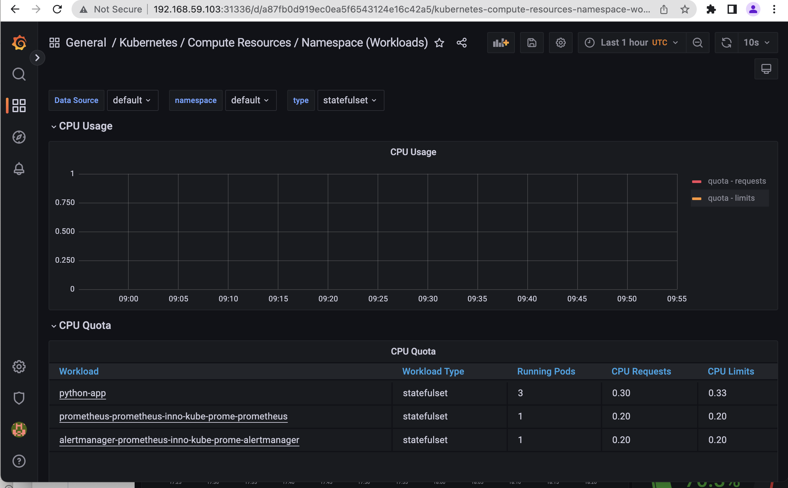
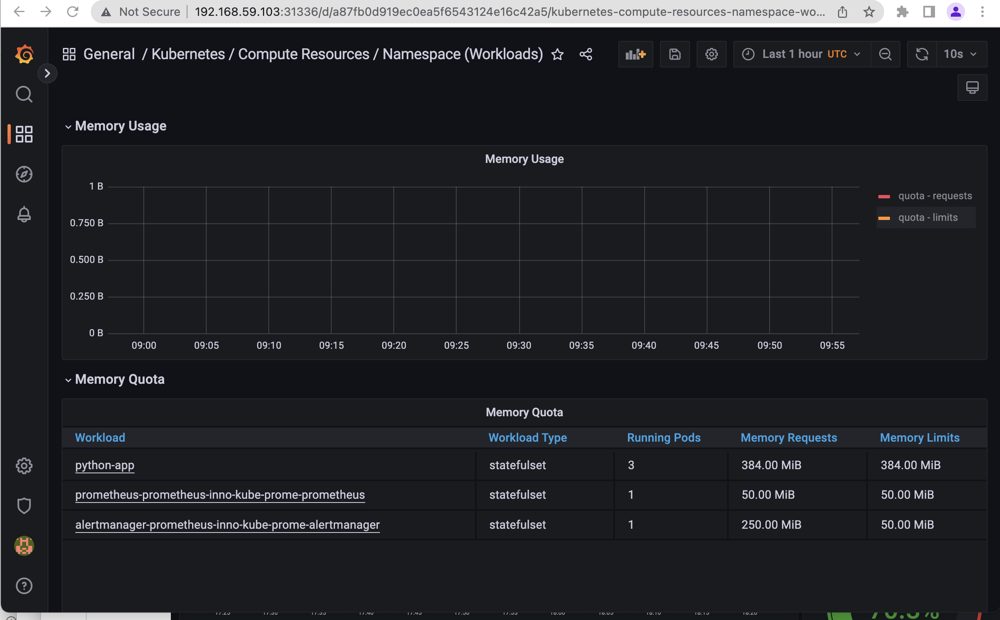
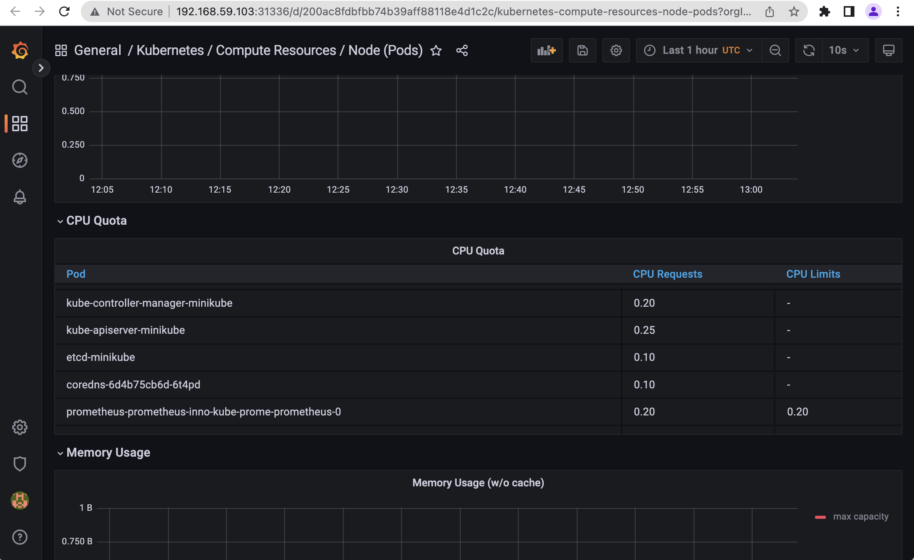
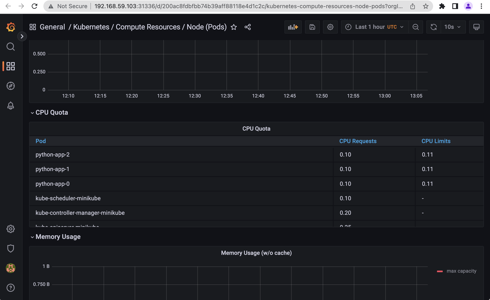
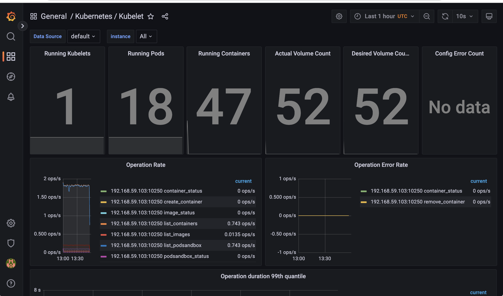
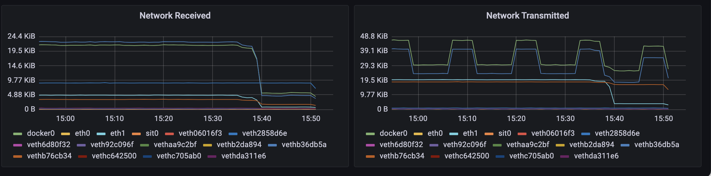
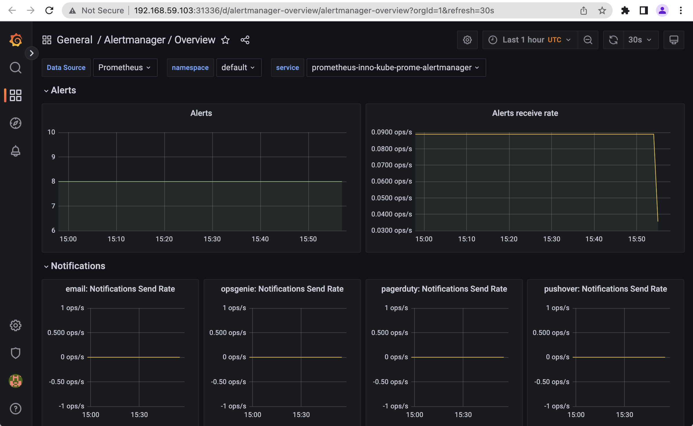
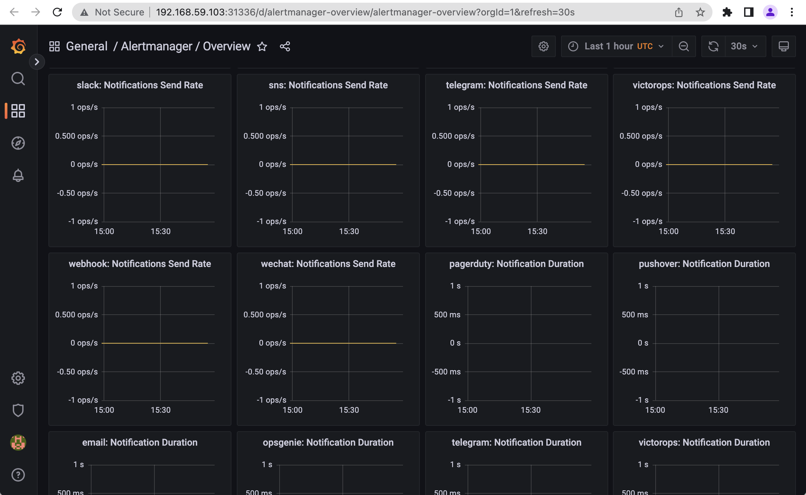

# Expalantion of the components

- Prometheus Operator: It provides the deployment and management of Prometheus and other monitoring components on a kubernetes cluser. Prometheus Operator uses Kubernetes resources to deploy and manage Prometheus. It also allows to configure a monitoring target using Kuberenetes label queries.
- Highly available Prometheus: Prometheus stores time series (which are identified by metrics and a set of key-value pairs) in memory and in local disk, and it is highly available due to functional sharding.
- Highly available Alertmanager: It manages/inhibits alerts sent by application clients, and routes them to the correct receiver such as email.
- Prometheus node-exporter: It provided metrics related to kerenl and to hardware.
- Prometheus Adapter for Kuberenetes Metrics APIs: It is an adapter provides an implmentation of metrics provided by Kuberenetes API such as resource metrics, custom metrics, and external metrics APIs.
- kube-state-metrics: It collects metrics from the Kubernetes API server, the metrics are not focused on Kubernetes components, but related to objects inside the Kuberenetes clusters such as nodes, pods, and deployments.
- Grafana: It is a visulaization tool that allows to display different metrics gathered by other tools (such as Prometheus), and it helps to monotor and to analyze the collected data over a period of time.

# The output of `kubectl get po,sts,svc,pvc,cm`

mac@macs-MacBook-Pro k8s % kubectl get po,sts,svc,pvc,cm
NAME                                                         READY   STATUS    RESTARTS        AGE
pod/alertmanager-prometheus-inno-kube-prome-alertmanager-0   2/2     Running   0               3m56s
pod/prometheus-inno-grafana-744795c9b-czvsp                  3/3     Running   0               4m23s
pod/prometheus-inno-kube-prome-operator-749dfb46f4-pxwzh     1/1     Running   0               4m23s
pod/prometheus-inno-kube-state-metrics-86f4f88664-nv8kv      1/1     Running   0               4m23s
pod/prometheus-inno-prometheus-node-exporter-7bzhm           1/1     Running   0               4m23s
pod/prometheus-prometheus-inno-kube-prome-prometheus-0       2/2     Running   0               3m55s
pod/python-app-0                                             1/1     Running   1 (3h55m ago)   4h44m
pod/python-app-1                                             1/1     Running   1 (3h55m ago)   4h45m
pod/python-app-2                                             1/1     Running   1 (3h55m ago)   4h46m

NAME                                                                    READY   AGE
statefulset.apps/alertmanager-prometheus-inno-kube-prome-alertmanager   1/1     3m56s
statefulset.apps/prometheus-prometheus-inno-kube-prome-prometheus       1/1     3m55s
statefulset.apps/python-app                                             3/3     5h33m

NAME                                               TYPE        CLUSTER-IP       EXTERNAL-IP   PORT(S)                      AGE
service/alertmanager-operated                      ClusterIP   None             <none>        9093/TCP,9094/TCP,9094/UDP   3m56s
service/kubernetes                                 ClusterIP   10.96.0.1        <none>        443/TCP                      12d
service/prometheus-inno-grafana                    ClusterIP   10.96.46.239     <none>        80/TCP                       4m23s
service/prometheus-inno-kube-prome-alertmanager    ClusterIP   10.102.39.179    <none>        9093/TCP                     4m23s
service/prometheus-inno-kube-prome-operator        ClusterIP   10.109.94.223    <none>        443/TCP                      4m23s
service/prometheus-inno-kube-prome-prometheus      ClusterIP   10.100.152.79    <none>        9090/TCP                     4m23s
service/prometheus-inno-kube-state-metrics         ClusterIP   10.109.238.136   <none>        8080/TCP                     4m23s
service/prometheus-inno-prometheus-node-exporter   ClusterIP   10.96.109.212    <none>        9100/TCP                     4m23s
service/prometheus-operated                        ClusterIP   None             <none>        9090/TCP                     3m55s
service/python-app                                 NodePort    10.111.235.159   <none>        80:32165/TCP                 6d7h

NAME                                        STATUS   VOLUME                                     CAPACITY   ACCESS MODES   STORAGECLASS   AGE
persistentvolumeclaim/visits-python-app-0   Bound    pvc-fdb56060-bd02-4c87-bad7-4bba70114b6b   1Gi        RWO            standard       5h33m
persistentvolumeclaim/visits-python-app-1   Bound    pvc-7f9d2a75-b40a-41b7-b425-9b310f318fe8   1Gi        RWO            standard       4h57m
persistentvolumeclaim/visits-python-app-2   Bound    pvc-f81c65a3-ec16-46fc-9907-04df4d6696ed   1Gi        RWO            standard       4h57m

NAME                                                                     DATA   AGE
configmap/kube-root-ca.crt                                               1      12d
configmap/prometheus-inno-grafana                                        2      4m24s
configmap/prometheus-inno-grafana-config-dashboards                      2      4m24s
configmap/prometheus-inno-grafana-test                                   1      4m24s
configmap/prometheus-inno-kube-prome-alertmanager-overview               1      4m24s
configmap/prometheus-inno-kube-prome-apiserver                           1      4m24s
configmap/prometheus-inno-kube-prome-cluster-total                       1      4m24s
configmap/prometheus-inno-kube-prome-controller-manager                  1      4m24s
configmap/prometheus-inno-kube-prome-etcd                                1      4m24s
configmap/prometheus-inno-kube-prome-grafana-datasource                  1      4m24s
configmap/prometheus-inno-kube-prome-grafana-overview                    1      4m24s
configmap/prometheus-inno-kube-prome-k8s-coredns                         1      4m24s
configmap/prometheus-inno-kube-prome-k8s-resources-cluster               1      4m24s
configmap/prometheus-inno-kube-prome-k8s-resources-namespace             1      4m24s
configmap/prometheus-inno-kube-prome-k8s-resources-node                  1      4m24s
configmap/prometheus-inno-kube-prome-k8s-resources-pod                   1      4m24s
configmap/prometheus-inno-kube-prome-k8s-resources-workload              1      4m24s
configmap/prometheus-inno-kube-prome-k8s-resources-workloads-namespace   1      4m24s
configmap/prometheus-inno-kube-prome-kubelet                             1      4m24s
configmap/prometheus-inno-kube-prome-namespace-by-pod                    1      4m24s
configmap/prometheus-inno-kube-prome-namespace-by-workload               1      4m24s
configmap/prometheus-inno-kube-prome-node-cluster-rsrc-use               1      4m24s
configmap/prometheus-inno-kube-prome-node-rsrc-use                       1      4m24s
configmap/prometheus-inno-kube-prome-nodes                               1      4m24s
configmap/prometheus-inno-kube-prome-nodes-darwin                        1      4m24s
configmap/prometheus-inno-kube-prome-persistentvolumesusage              1      4m24s
configmap/prometheus-inno-kube-prome-pod-total                           1      4m24s
configmap/prometheus-inno-kube-prome-prometheus                          1      4m24s
configmap/prometheus-inno-kube-prome-proxy                               1      4m24s
configmap/prometheus-inno-kube-prome-scheduler                           1      4m24s
configmap/prometheus-inno-kube-prome-workload-total                      1      4m24s
configmap/prometheus-prometheus-inno-kube-prome-prometheus-rulefiles-0   29     3m56s
configmap/sherlock-config                                                1      6d
mac@macs-MacBook-Pro k8s % 

The command gives information about the following:
- `po`: about pods in the cluster.
- `sts`: about statefulset.
- `svc`: about services.
- `pvc`: about persistent volume
- `cm`: about configmap

# Grafana dahsboard

- How much CPU the StatefulSet is consuming
**CPU:** 0.30 requests

- How much memory the StatefulSet is consuming
**Memory:** 384.00Mib

- Pod with the highest CPU usage: prometheus-prometheus-inno-kube-prome-prometheus-0  0.20 CPU requests

- Pod with the lowest CPU usage: python-app pods,  0.10 CPU requests

- How much memory is used in my node: Percentage: 69.4%, 1.86GiB

- How many pods and containers are run by kubelet service:

- Pod using more and less network in the default namespace:

- Alerts

