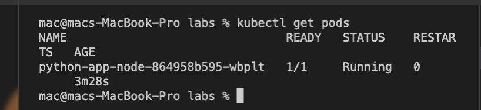

# Output of `kubectl get pods`

`mac@macs-MacBook-Pro labs % kubectl get pods`
`NAME                               READY   STATUS    RESTARTS   AGE`
`python-app-node-864958b595-wbplt   1/1     Running   0          3m28s`
`mac@macs-MacBook-Pro labs %`

# Ouput of `svc`

