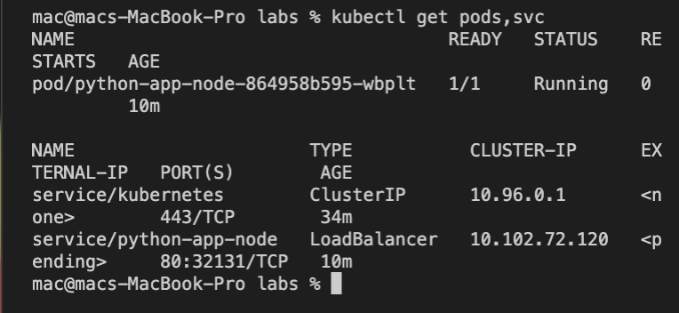
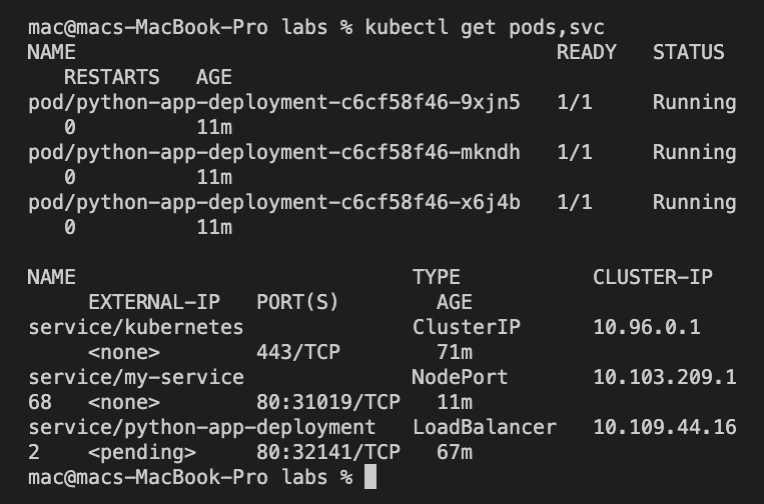
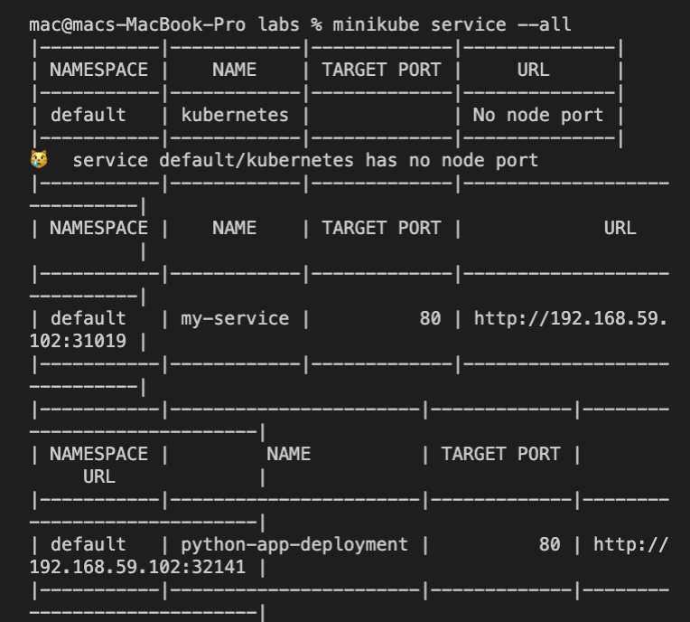
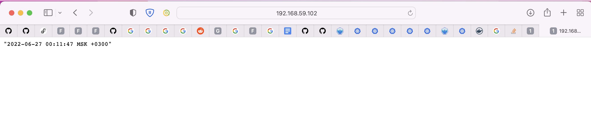

# Output of `kubectl get pods,svc`

mac@macs-MacBook-Pro labs % kubectl get pods,svc
NAME                                   READY   STATUS    RESTARTS   AGE
pod/python-app-node-864958b595-wbplt   1/1     Running   0          10m

NAME                      TYPE           CLUSTER-IP      EXTERNAL-IP   PORT(S)        AGE
service/kubernetes        ClusterIP      10.96.0.1       <none>        443/TCP        34m
service/python-app-node   LoadBalancer   10.102.72.120   <pending>     80:32131/TCP   10m

# Using yml files

- Ouput of `kubectl get pods, svc`: 

mac@macs-MacBook-Pro labs % kubectl get pods,svc
NAME                                        READY   STATUS    RESTARTS   AGE
pod/python-app-deployment-c6cf58f46-9xjn5   1/1     Running   0          11m
pod/python-app-deployment-c6cf58f46-mkndh   1/1     Running   0          11m
pod/python-app-deployment-c6cf58f46-x6j4b   1/1     Running   0          11m

NAME                            TYPE           CLUSTER-IP       EXTERNAL-IP   PORT(S)        AGE
service/kubernetes              ClusterIP      10.96.0.1        <none>        443/TCP        71m
service/my-service              NodePort       10.103.209.168   <none>        80:31019/TCP   11m
service/python-app-deployment   LoadBalancer   10.109.44.162    <pending>     80:32141/TCP   67m
mac@macs-MacBook-Pro labs % 

- Output of `minikube service --all`:

mac@macs-MacBook-Pro labs % minikube service --all
|-----------|------------|-------------|--------------|
| NAMESPACE |    NAME    | TARGET PORT |     URL      |
|-----------|------------|-------------|--------------|
| default   | kubernetes |             | No node port |
|-----------|------------|-------------|--------------|
😿  service default/kubernetes has no node port
|-----------|------------|-------------|-----------------------------|
| NAMESPACE |    NAME    | TARGET PORT |             URL             |
|-----------|------------|-------------|-----------------------------|
| default   | my-service |          80 | http://192.168.59.102:31019 |
|-----------|------------|-------------|-----------------------------|
|-----------|-----------------------|-------------|-----------------------------|
| NAMESPACE |         NAME          | TARGET PORT |             URL             |
|-----------|-----------------------|-------------|-----------------------------|
| default   | python-app-deployment |          80 | http://192.168.59.102:32141 |
|-----------|-----------------------|-------------|-----------------------------|

- Screenshot of url from the browser: 

