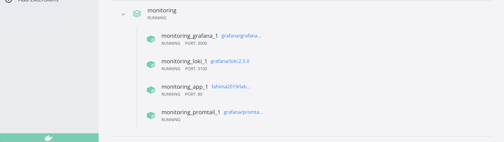
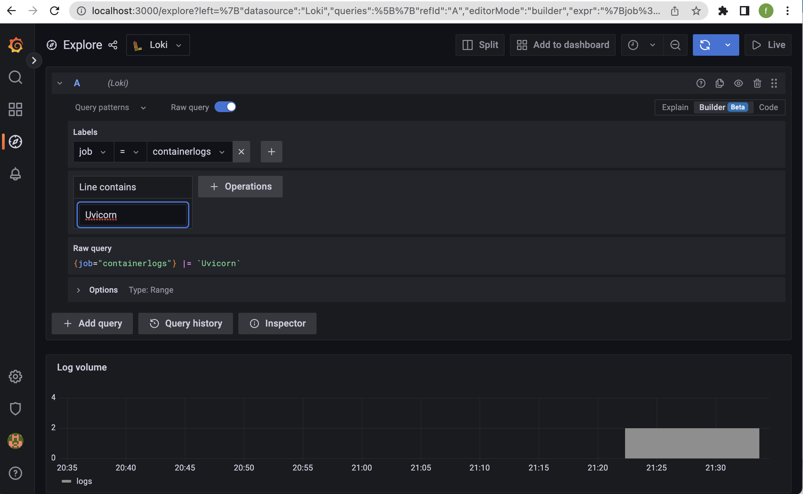
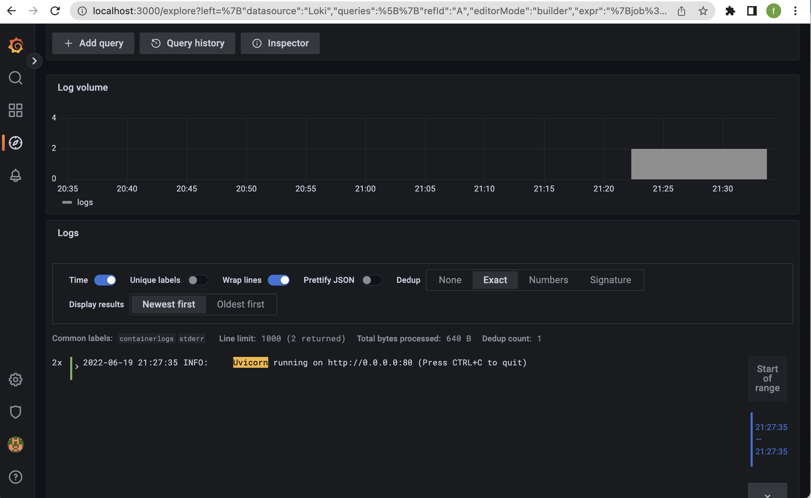
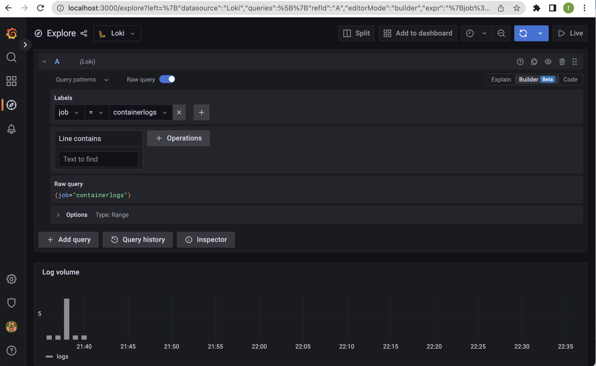
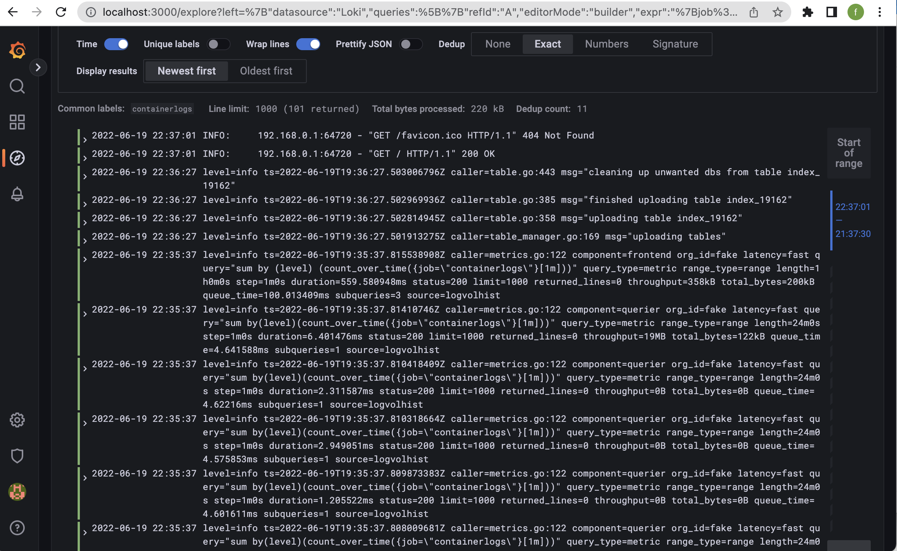

# Grafana

`Grafana`, `Loki`, and `Promtail` were used to do the logging for this app. Below, there the screenshots from `Grafana` showing the logs and the job that we created for collecting the graphs, and screenshots showing the different components of the stack (Grafana, Loki, Promtail) and the app.

# Screenshots

# Best practices

- Use static labels: When having properties that have bounded values and that can be used for an entire system/app,such as host, and environment. using static labels will make it easier to query logs in a logical sense.
- Use dynamic labels sparingly: By avoiding to use many combinations of label values as they will a penalty for `Loki` (large indexes and small chunks stored).
- Label values must be alwyas bounded: When dynamically setting labels, developers need to make sure that they will never use labels which hold infinite or unbounded values, in order to avoid big problems with `Loki`. 
- Pay attention to client when using dynamic labels: `Loki`is supported by several clients other than `Promtail`, as each client is configured how to labels are applied in order to log streams. 
- Configure caching: `Loki` can cache data which can significantly improve performance.
- Time ordering of logs: By default, `Loki` accepts out of order writes,and when it is not configured this way, out of order logs will be rejected.
- Use `chunk_target_size`: This instruction tells `Loki` to try to fill chunks to a traget compressed size of 1.5MB, which are more efficient for Loki to process.
- Use `-print-config-stderr` or `-log-config-reverse-order`: The first flag works well when inviting `Loki` from the command line and you can quickly get `Loki` configuration. As for the second, we can run it with `Loki` in all environements, the configuration entries are reversed in a way that the order of the configuration reads correctly top to bottom when viewed in Grafana’s Explore.